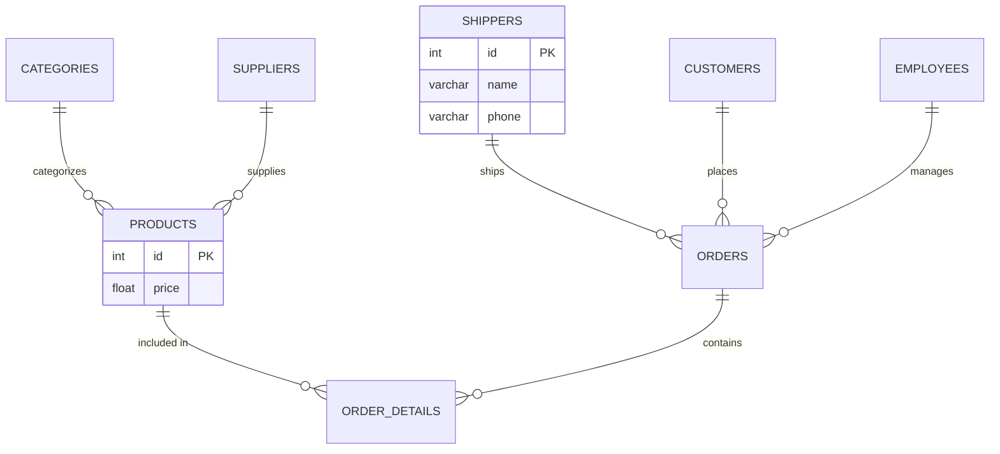
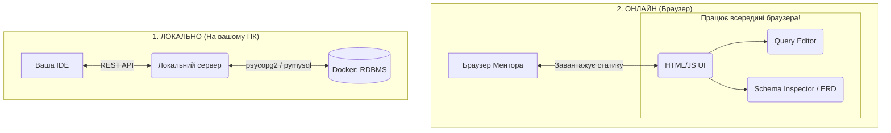

# goit-rdb-hw-03


***Технiчний опис завдань***

## **Тема 3: Завантаження даних та основи SQL. DQL команди**

### Вам потрібно буде:

У цьому домашньому завданні необхідно застосувати знання для отримання конкретної інформації із завантаженого датасету (файли формату `.csv`), **написавши серію аналітичних SQL-запитів.**

### Це завдання допоможе вам:

Здатність ефективно створювати та оптимізувати запити DQL є важливою навичкою для обробки та аналізу великих обсягів даних. Ви як майбутні фахівці матимете можливість використовувати ці навички для розв'язання завдань у сфері розробки програмного забезпечення, аналізу даних та багатьох інших галузях.

### Підготовка та завантаження домашнього завдання:

1. Створіть публічний репозиторій `goit-rdb-hw-03`
2. Якщо раніше ви не завантажували [цей архів](https://drive.google.com/file/d/1B45tkzH3lIrf2CmQIB2VB0AJRB9Ly7c2/view?usp=drive_link) з даними у форматі `“csv”`, зробіть це зараз
3. Виконайте завдання та відправте у свій репозиторій скриншоти запитів і результатів, а також текст `SQL` коду в текстовому файлі
4. Завантажте скриншоти і текстовий файл на свій комп’ютер та прикріпіть їх в `LMS` архівом. Назва архіву повинна бути у форматі `ДЗ3_ПІБ`
5. Прикріпіть посилання на репозиторій `goit-rdb-hw-03` та відправте на перевірку.

> 💡 Будь ласка, пронумеровуйте скріншоти, щоб менторам було зрозуміло, до якого етапу ДЗ відноситься кожний з них. Наприклад, якщо файл відноситься до пункту 3, то назва файла має починатися так: p3_.

### Опис домашнього завдання:

1. Напишіть SQL команду, за допомогою якої можна:
   - вибрати всі стовпчики (За допомогою wildcard “*”) з таблиці `products`
   - вибрати тільки стовпчики `name`, `phone` з таблиці `shippers` та перевірте правильність її виконання в *MySQL Workbench*
2. Напишіть SQL команду, за допомогою якої можна знайти середнє, максимальне та мінімальне значення стовпчика `price` таблички `products`, та перевірте правильність її виконання в *MySQL Workbench*
3. Напишіть `SQL` команду, за допомогою якої можна:
   - обрати унікальні значення колонок `category_id` та `price` таблиці `products`
   - Оберіть порядок виведення на екран за спаданням значення `price` та виберіть тільки 10 рядків
   - Перевірте правильність виконання команди в *MySQL Workbench*
4. Напишіть `SQL` команду, за допомогою якої можна знайти кількість продуктів (рядків), які знаходиться в цінових межах від 20 до 100, та перевірте правильність її виконання в *MySQL Workbench*
5. Напишіть `SQL` команду, за допомогою якої можна знайти кількість продуктів (рядків) та середню ціну (`price`) у кожного постачальника (`supplier_id`), та перевірте правильність її виконання в *MySQL Workbench*

### Критерії прийняття:

> **Критерії прийняття домашнього завдання є обов’язковою умовою оцінювання домашнього завдання ментором. Якщо якийсь з критеріїв не виконано, ДЗ відправляється ментором на доопрацювання без оцінювання.**
> Якщо вам “тільки уточнити”😉 або ви “застопорилися” на якомусь з етапів виконання— звертайтеся до ментора у Slack)

1. Прикріплені посилання на репозиторій `goit-rdb-hw-03` та безпосередньо самі файли репозиторію архівом
2. Написано всі 6 команд. SQL команди виконуються й повертають необхідні дані

---

## 🛡️ DevOpsML SQL Lab - Завдання 03 (goit-rdb-hw-03)

### 1. Як все запустити

Завдяки вбудованому оркестратору (`Makefile`), запуск і налаштування інфраструктури повністю автоматизовані.

#### 🚀 Швидкий запуск (В одну команду)

1. Клонуйте репозиторій.
2. Переконайтесь, що у вас встановлені **Docker** та **Make**.
3. Створіть файл `.env` з паролями (дивіться `.env.example`).
4. Виконайте команду:

   ```bash
   make start
   ```

- 🐳 Перевірить і самостійно запустить Docker (якщо він був вимкнений).
- 🧱 Підніме Backend-інфраструктуру (API ядро та Adminer).
- 📦 Ініціалізує ізольоване віртуальне середовище `.venv`.
- 🌐 Запустить Frontend-сервер.
- 🖥️ **Самостійно відкриє браузер** із готовою SQL IDE за адресою `http://127.0.0.1:3000`.

### 📦 Standalone-версія

Для збірки проекту в єдиний HTML-файл (включаючи JS, CSS та вшитий SQL-код):

```bash
make build
```

#### 🛠️ Додаткові команди (Управління ядром)

Ваш термінал тепер — це пульт управління всіма базами даних. Ось основні команди:

- `make help` — показати інтерактивне меню з усіма доступними командами.
- `make db-manage` — відкрити CLI-менеджер фабрики баз даних (дозволяє на льоту створювати/видаляти контейнери з PostgreSQL, MySQL, MSSQL чи Oracle).
- `make db-adminer` — автоматично відкрити резервну панель **Adminer** у браузері (`http://127.0.0.1:8080`).
- `make down` — безпечно зупинити всі контейнери Backend-у.
- `make clean` — **Hard Reset**: жорстко видаляє всі згенеровані бази даних, контейнери, мережу та `.venv`, повертаючи проект до абсолютно чистого стану.

---

### 2. Структура проекту, ER-діаграма та Flowchart

#### Структура проекту - Логічний (Business-Logic First)

```text
goit-rdb-hw-03/                 # 🌌 Універсальний простір стенду
│
├── backend/                    # 🐍 Backend Service (Python / FastAPI)
│   ├── main.py                 # REST API та SQL Execution Engine
│   ├── db_manager.py           # 🗄️ CLI-менеджер інфраструктури (Docker, Dump/Restore)
│   ├── Dockerfile              # 🫍 Конфігурація мікросервісу
│   └── requirements.txt        # 🧬 Залежності бекенду
│
├── frontend/                   # 🌐 Frontend App (Vanilla JS / Event-Driven)
│   ├── css/                    # 🎨 Tailwind конфіги та UI теми (Dracula/Alucard)
│   ├── dicts/                  # 🧠 Словники IntelliSense для різних СУБД
│   │   ├── mssql.json          # Словник для MS SQL Server
│   │   ├── mysql.json          # Словник для MySQL
│   │   ├── oracle.json         # Словник для Oracle DB
│   │   └── postgres.json       # Словник для PostgreSQL
│   ├── js/                     # ⚙️ Бізнес-логіка
│   │   ├── core.js             # 🚌 Event Bus (Шина подій)
│   │   ├── config.js           # 🔧 Глобальний State
│   │   └── components/         # 🧩 Ізольовані UI-модулі
│   │       ├── 1_WorkspaceHeader.js  # 🎛️ Панель управління, підключення та теми
│   │       ├── 2_QueryEditor.js      # 📝 CodeMirror, таби завдань, God Mode
│   │       ├── 3_DataGrid.js         # 📊 Рендеринг таблиць та ETL-імпорт CSV
│   │       ├── 4_SchemaInspector.js  # 🕸️ Генерація ER-діаграм (Mermaid.js)
│   │       ├── 5_ConsoleLogger.js    # 💻 Вбудований термінал логів та помилок
│   │       └── 6_SnippetEngine.js    # ✂️ Управління шаблонами коду та автозаповненням
│   ├── locales/                # 🌍 Мовні пакети (uk.js, en.js)
│   ├── sql/                    # 📜 SQL-скрипти (DDL/DML/DQL)
│   │   └── default.sql         # 🏆 Головний файл SQL-запитів до поточного ДЗ
│   └── index.html              # Головний Entry Point
│
├── data/                       # 📊 Набір даних (ETL Sources)
│   └── *.csv                   # Сирі дані для імпорту в таблиці
│
├── img/                        # 🖼️ Медіа-ассети для оформлення ReadMe.md
│   └── *.png                   # Скриншоти результатів для здачі ДЗ в LMS
│
├── .venv/                      # 📦 Ізольоване середовище Python (Автогенерація)
├── databases.json              # 🗄️ Реєстр активних БД-контейнерів
├── docker-compose.yml          # 🐳 Мережева інфраструктура
├── Makefile                    # 🪄 Головний Оркестратор (make start, make db-add)
├── builder.py                  # 🛠️ CI/CD Бандлер (Збірка HTML версії)
├── hw_submission.html          # 📦 Фінальний артефакт (Генерується 'make build')
├── sql_query_***.sql           # 💾 Експортовані нашою IDE SQL-скрипти для MySQL
├── backup_mysql_1055_***.sql   # 📦 Повний SQL-дамп MySQL
├── .editorconfig               # ⚙️ Правила форматування коду для IDE
├── .gitignore                  # 🙈 Файли, які ігнорує Git
└── README.md                   # 📖 Технічна документація проекту
```

#### ER-Діаграма Датасету (Mermaid)



#### Архітектура виконання



---

## 3. Висновки з усіма світлинами

У ході виконання завдання було проведено повний цикл роботи з даними: від імпорту сирих CSV-файлів до агрегаційного аналізу. Всі запити були оптимізовані та перевірені у власній SQL IDE.

#### 🖼️ Світлини виконання

**Крок 1.1: Вибір всіх стовпчиків (`SELECT *`)**


**Крок 1.2: Вибір конкретних колонок `shippers`**


**Крок 2: Агрегатні функції (AVG, MAX, MIN)**


**Крок 3: Унікальність та сортування (DISTINCT, ORDER BY, LIMIT)**


**Крок 4: Фільтрація діапазонів (BETWEEN, COUNT)**


**Крок 5: Групування даних (GROUP BY, AVG)**


#### 📊 Фінальна ER-діаграма згенерована системою


*Таблиці в базі даних (Інтерфейс моєї IDE):*  


---

### 4. 🚀 Аудит екосистеми: DevOpsML SQL Lab

Наша IDE складається з 6 повністю незалежних, але глибоко інтегрованих модулів. Кожен модуль відповідає за свою зону і спілкується з іншими через глобальний Event Bus (подієву архітектуру). *Ще є багато чого, що у майбутньому покращиться...*

| Модуль | Стан | Опис реалізації |
| :--- | :--- | :--- |
| **Workspace & Core** | ✅ | Event Bus архітектура на базі Custom Events для синхронізації станів. |
| **Query Editor** | ✅ | CodeMirror 5 з AST-форматуванням та підтримкою діалектів СУБД. |
| **Data Grid & Import** | ✅ | Транзакційний батч-імпорт (5000 рядків/чанк) з Auto-Type Inference. |
| **Schema Inspector** | ✅ | Динамічна побудова DAG-сітки таблиць та Crow's Foot нотація. |
| **Console Logger** | ✅ | Потоковий висновок системних подій з підтримкою локалізації. |
| **Snippet Engine** | ✅ | Генерація Boilerplate коду для 13 мов (Python, Rust, Go та ін.). |
