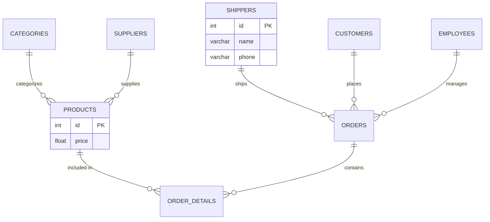
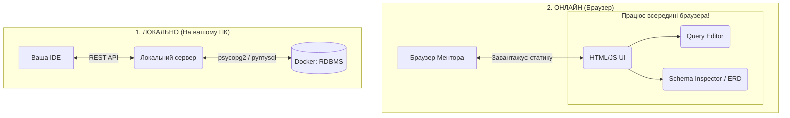
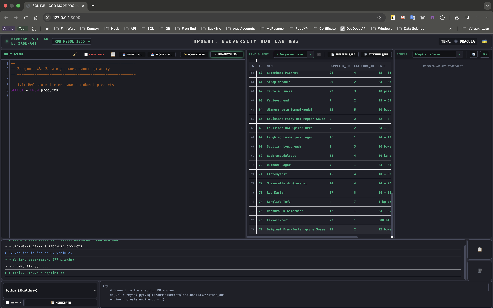
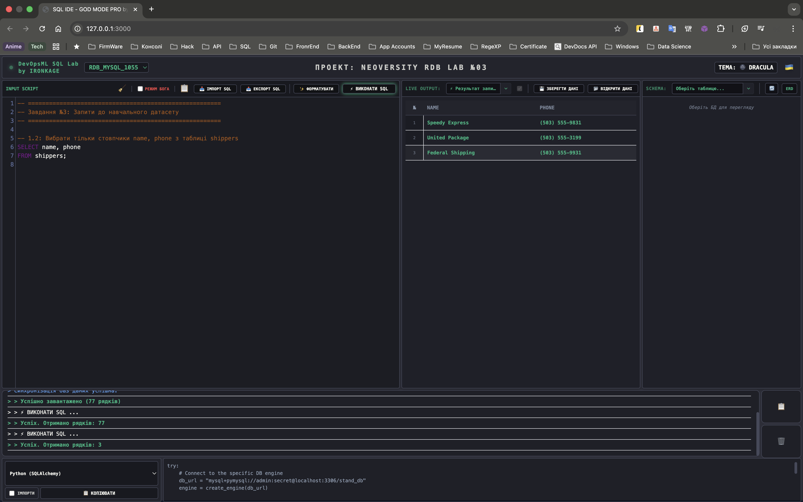
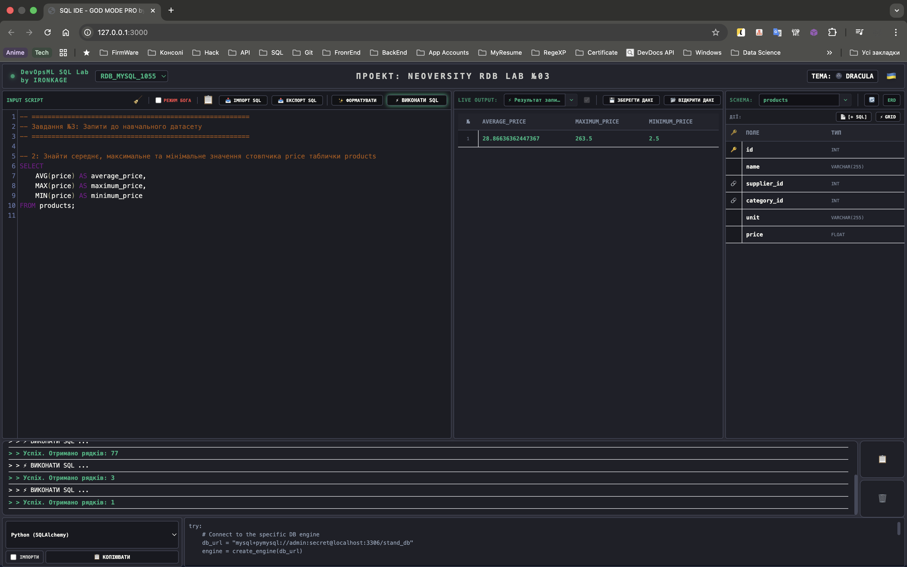
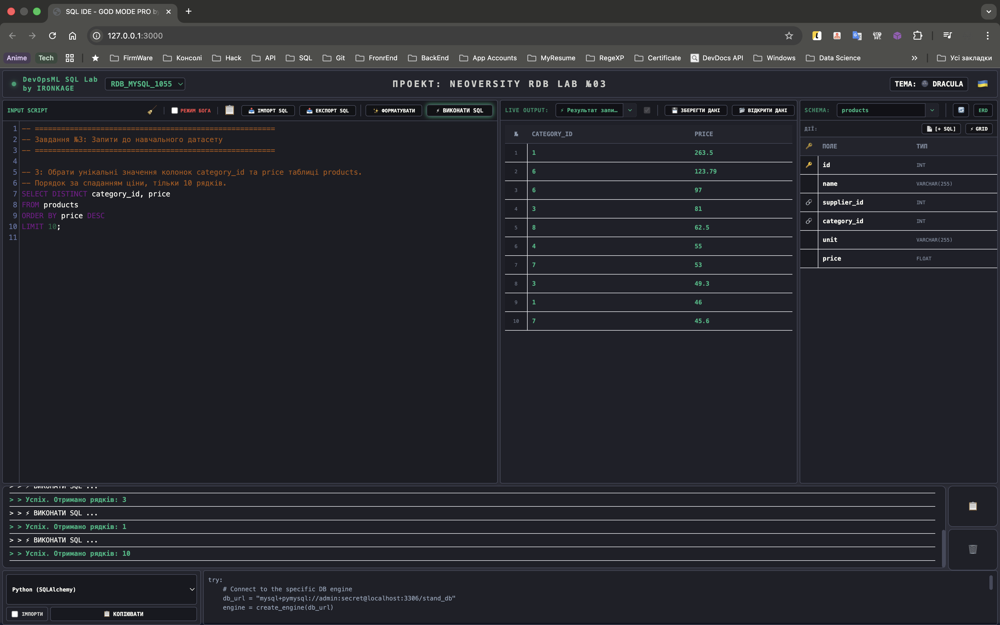
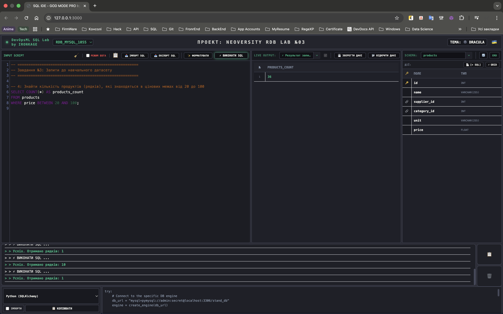
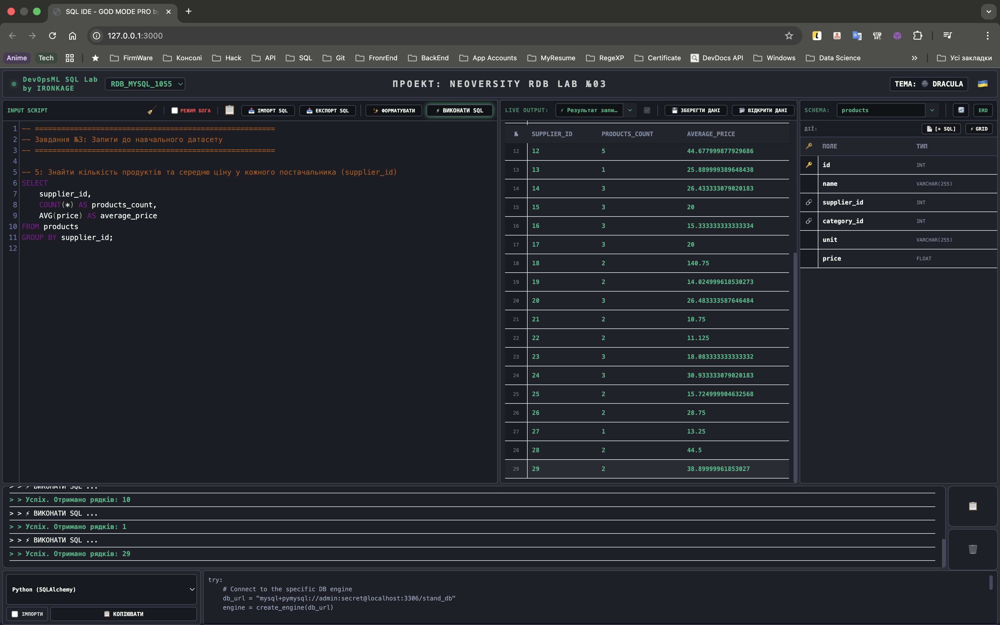
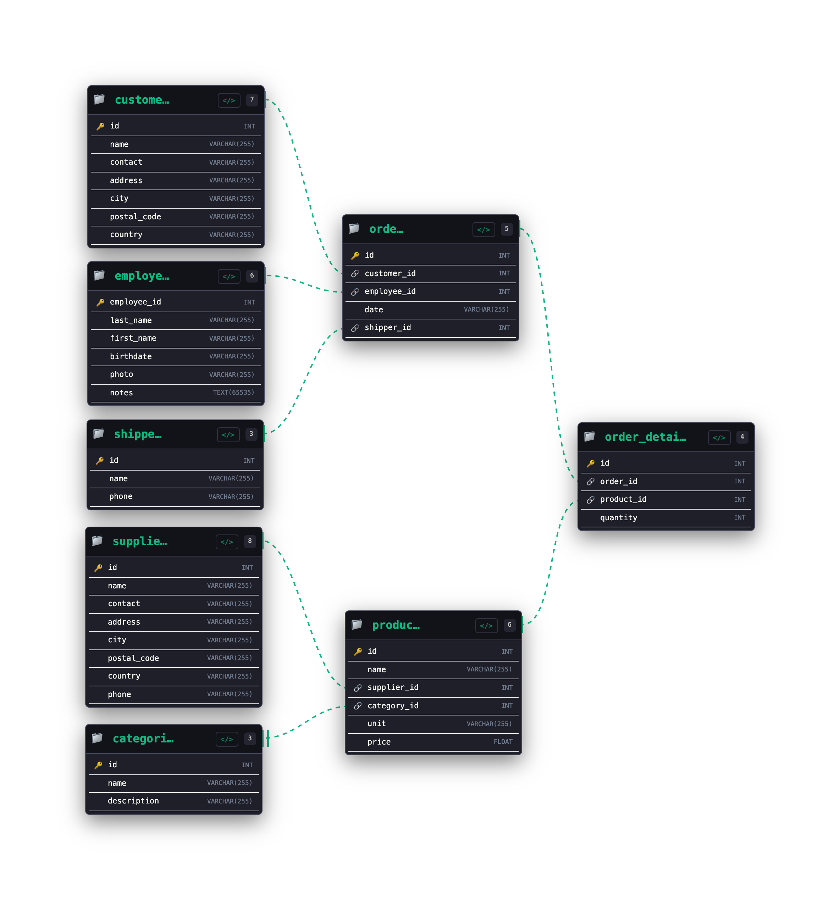
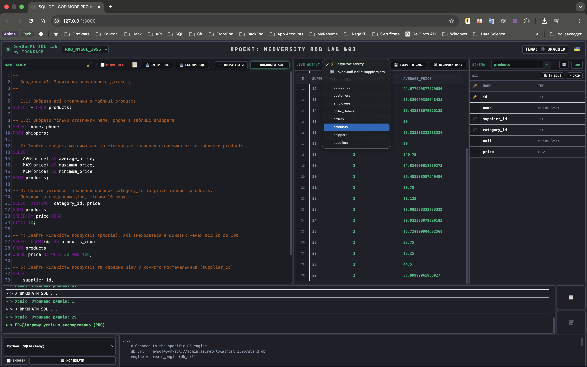

# goit-rdb-hw-03


***Технiчний опис завдань***

## 1. **Завдання 3: Завантаження даних та основи SQL. DQL команди**

***Вам потрібно буде:***

У цьому домашньому завданні необхідно застосувати знання для отримання конкретної інформації із завантаженого датасету (файли формату `.csv`), **написавши серію аналітичних SQL-запитів.**

***Це завдання допоможе вам:***

Здатність ефективно створювати та оптимізувати запити DQL є важливою навичкою для обробки та аналізу великих обсягів даних. Ви як майбутні фахівці матимете можливість використовувати ці навички для розв'язання завдань у сфері розробки програмного забезпечення, аналізу даних та багатьох інших галузях.

***Підготовка та завантаження домашнього завдання:***

1. Створіть публічний репозиторій `goit-rdb-hw-03`
2. Якщо раніше ви не завантажували [цей архів](https://drive.google.com/file/d/1B45tkzH3lIrf2CmQIB2VB0AJRB9Ly7c2/view?usp=drive_link) з даними у форматі `“csv”`, зробіть це зараз
3. Виконайте завдання та відправте у свій репозиторій скриншоти запитів і результатів, а також текст `SQL` коду в текстовому файлі
4. Завантажте скриншоти і текстовий файл на свій комп’ютер та прикріпіть їх в `LMS` архівом. Назва архіву повинна бути у форматі `ДЗ3_ПІБ`
5. Прикріпіть посилання на репозиторій `goit-rdb-hw-03` та відправте на перевірку.

> 💡 Будь ласка, пронумеровуйте скріншоти, щоб менторам було зрозуміло, до якого етапу ДЗ відноситься кожний з них. Наприклад, якщо файл відноситься до пункту 3, то назва файла має починатися так: p3_.


## 1. Завдання 3: Отримання інформації з датасету (SQL запити)

**Опис домашнього завдання:**

1. Напишіть SQL команду, за допомогою якої можна:
   - вибрати всі стовпчики (За допомогою wildcard “*”) з таблиці `products`
   - вибрати тільки стовпчики `name`, `phone` з таблиці `shippers` та перевірте правильність її виконання в *MySQL Workbench*
2. Напишіть SQL команду, за допомогою якої можна знайти середнє, максимальне та мінімальне значення стовпчика `price` таблички `products`, та перевірте правильність її виконання в *MySQL Workbench*
3. Напишіть `SQL` команду, за допомогою якої можна:
   - обрати унікальні значення колонок `category_id` та `price` таблиці `products`
   - Оберіть порядок виведення на екран за спаданням значення `price` та виберіть тільки 10 рядків
   - Перевірте правильність виконання команди в *MySQL Workbench*
4. Напишіть `SQL` команду, за допомогою якої можна знайти кількість продуктів (рядків), які знаходиться в цінових межах від 20 до 100, та перевірте правильність її виконання в *MySQL Workbench*
5. Напишіть `SQL` команду, за допомогою якої можна знайти кількість продуктів (рядків) та середню ціну (`price`) у кожного постачальника (`supplier_id`), та перевірте правильність її виконання в *MySQL Workbench*

Критерії прийняття:

> **Критерії прийняття домашнього завдання є обов’язковою умовою оцінювання домашнього завдання ментором. Якщо якийсь з критеріїв не виконано, ДЗ відправляється ментором на доопрацювання без оцінювання.**
> Якщо вам “тільки уточнити”😉 або ви “застопорилися” на якомусь з етапів виконання— звертайтеся до ментора у Slack)

1. Прикріплені посилання на репозиторій `goit-rdb-hw-03` та безпосередньо самі файли репозиторію архівом
2. Написано всі 6 команд. SQL команди виконуються й повертають необхідні дані

---

# 🛡️ DevOpsML SQL Lab - Завдання 03 (goit-rdb-hw-03)

## 2. Як все запустити

Завдяки вбудованому оркестратору (`Makefile`), запуск і налаштування інфраструктури повністю автоматизовані.

### 🚀 Швидкий запуск (В одну команду)

1. Клонуйте репозиторій.
2. Переконайтесь, що у вас встановлені **Docker** та **Make**.
3. Створіть файл `.env` з паролями (дивіться `.env.example`).
4. Виконайте команду:

   ```bash
   make start
   ```

- 🐳 Перевірить і самостійно запустить Docker (якщо він був вимкнений).
- 🧱 Підніме Backend-інфраструктуру (API ядро та Adminer).
- 📦 Ініціалізує ізольоване віртуальне середовище `.venv`.
- 🌐 Запустить Frontend-сервер.
- 🖥️ **Самостійно відкриє браузер** із готовою SQL IDE за адресою `http://127.0.0.1:3000`.

### 📦 Standalone-версія

Для збірки проєкту в єдиний HTML-файл (включаючи JS, CSS та вшитий SQL-код):

```bash
make build
```

---

## 3. Структура проекту, ER-діаграма та Flowchart

### Структура проекту

```text
goit-rdb-hw-03/
├── backend/                    # 🐍 Ядро управління БД (Python API)
│   ├── db_manager.py           # CLI-менеджер фабрики баз даних
│   ├── dockerfile              # Конфігурація контейнера
│   └── requirements.txt        # Залежності
│
├── frontend/                   # 🌐 Клієнтська частина IDE (Vanilla JS)
│   ├── css/                    # 🎨 UI стилі
│   ├── js/                     # ⚙️ Логіка (6 модулів)
│   ├── sql/                    
│   │   └── default.sql         # 🏆 6 SQL-запитів рішення ДЗ №3
│   └── index.html              
│
├── data/                       # 📊 Навчальний датасет (CSV-файли)
│   ├── categories.csv
│   ├── customers.csv
│   ├── products.csv
│   ├── shippers.csv
│   └── ... (інші таблиці)
│
├── builder.py                  # 🛠️ Бандлер для Standalone-версії
├── docker-compose.yml          # 🐳 Docker інфраструктура
├── Makefile                    # 🪄 Оркестратор (make start, make build)
├── hw_submission.html          # 📦 Зібраний All-in-One файл (генерується 'make build')
└── README.md                   # 📖 Документація
```

### ER-Діаграма Датасету (Mermaid)



### Архітектура виконання



---

## 4. Висновки з усіма світлинами

У ході виконання завдання було проведено повний цикл роботи з даними: від імпорту сирих CSV-файлів до агрегаційного аналізу. Всі запити були оптимізовані та перевірені у власній SQL IDE.

### 🖼️ Світлини виконання

**Крок 1.1: Вибір всіх стовпчиків (`SELECT *`)**


**Крок 1.2: Вибір конкретних колонок `shippers`**


**Крок 2: Агрегатні функції (AVG, MAX, MIN)**


**Крок 3: Унікальність та сортування (DISTINCT, ORDER BY, LIMIT)**


**Крок 4: Фільтрація діапазонів (BETWEEN, COUNT)**


**Крок 5: Групування даних (GROUP BY, AVG)**


### 📊 Фінальна ER-діаграма згенерована системою



*Таблиці в базі даних (Інтерфейс моєї IDE):*  


---

## 5. 🚀 АУДИТ ЕКОСИСТЕМИ: DevOpsML SQL Lab

Наша IDE складається з 6 повністю незалежних, але глибоко інтегрованих модулів. Кожен модуль відповідає за свою зону і спілкується з іншими через глобальний Event Bus (подієву архітектуру). *Ще є багато чого, що у майбутньому покращиться...*

| Модуль | Стан | Опис реалізації |
| :--- | :--- | :--- |
| **Workspace & Core** | ✅ | Event Bus архітектура на базі Custom Events для синхронізації станів. |
| **Query Editor** | ✅ | CodeMirror 5 з AST-форматуванням та підтримкою діалектів СУБД. |
| **Data Grid & Import** | ✅ | Транзакційний батч-імпорт (5000 рядків/чанк) з Auto-Type Inference. |
| **Schema Inspector** | ✅ | Динамічна побудова DAG-сітки таблиць та Crow's Foot нотація. |
| **Console Logger** | ✅ | Потоковий висновок системних подій з підтримкою локалізації. |
| **Snippet Engine** | ✅ | Генерація Boilerplate коду для 13 мов (Python, Rust, Go та ін.). |
